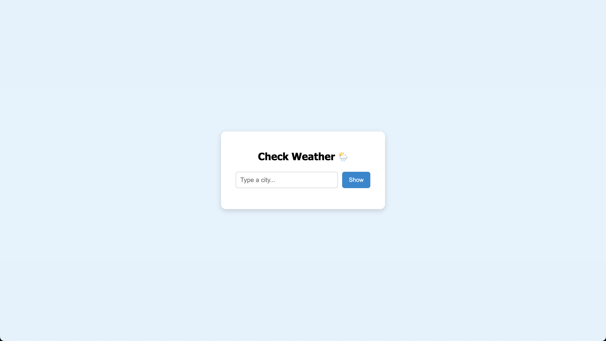

# 🌦️ Weather App

A simple, clean weather web application built using **HTML**, **CSS**, and **JavaScript**. It allows users to check the current weather for any city using the [OpenWeatherMap API](https://openweathermap.org/api).

---

## 🔍 Preview



---

## ✨ Features

- Enter any city name to view real-time weather
- Shows:
  - 🌡️ Temperature (in Celsius)
  - ☁️ Weather Condition (e.g., Clear, Rain, Clouds)
  - 📍 City Name
- Mobile responsive design
- Simple and intuitive user interface
- Error messages for invalid input or connection issues

---

## 📁 Project Structure

```
weather-app/
│
├── index.html         # Main HTML file
├── style.css          # Styling (responsive and modern)
├── main.js            # JavaScript with XMLHttpRequest
├── screenshot.png     # Screenshot of the project
└── README.md          # This file
```

---

## 🚀 How to Run the App

1. **Clone or Download** the project folder.

2. Open `index.html` in any modern browser (Chrome, Firefox, etc).

3. No installations are needed — it’s pure frontend code.

4. To use your own API key:
   - Go to [OpenWeatherMap](https://openweathermap.org/api) and sign up for a free API key.
   - Replace the API key in `main.js`:

```js
var apiKey = 'YOUR_API_KEY_HERE';
```

---

## ⚙️ How It Works (For Viva/Interview)

- JavaScript reads the city name from user input.
- Sends a request to OpenWeatherMap's API with the city name and your API key.
- Receives data in JSON format.
- Parses and displays:
  - City
  - Temperature
  - Weather description
- Errors (like invalid city names) are handled and shown to the user.

---

## 🧰 Technologies Used

- HTML5  
- CSS3
- JavaScript
- OpenWeatherMap API

---

## 📝 Notes

- No frameworks or libraries were used (like jQuery, React, etc).
- The app works on both desktop and mobile.
- Ideal for beginners learning how APIs work in JavaScript.

---

## 📸 Screenshot Instructions

- Run the app.
- Take a screenshot (use `PrtScn` or any screenshot tool).
- Save it as `screenshot.png` in the same project folder.
- This will appear in the preview section above.

---

## 📃 License

This project is made for educational and academic purposes. Free to use, modify, and submit 😊
